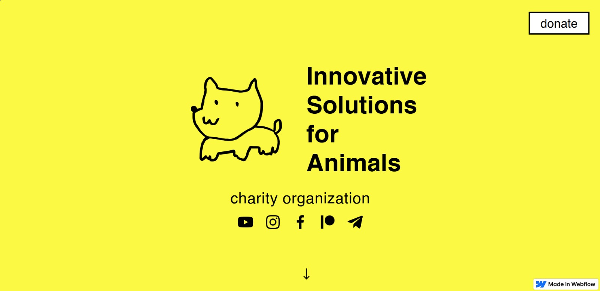

# Charity Animals: Website Duplication of isa-charity.webflow.io

The website isa-charity.webflow.io belongs to the charity organization ISA (Innovative Solutions for Animals). This site communicates their mission to help stray and abandoned animals through:

1. Emergency aid, such as food and medicine for animals affected by war.
2. Free feed production, by building a non-commercial industrial facility.
3. Education and control, through training and supervision of aid usage.

## ✨ Features

- Scroll-triggered animation with GSAP
- Responsive layout with media queries
- Animated headers with reusable structure

## 🧠 Technologies Used

- Node.js v20.10.0
- Vue.js 3
- GSAP v3.13.0
- NPM 10.2.5
- ScrollTrigger
- Vite 
- Sass
- Javascript
- HTML
- CSS

## 🚀 Link Demo

[Link to live demo](https://charity-animals.vercel.app/)

## 🖼️ Screenshot



## 📁 Folder Structures

```text
📁 src
├── 📁 assets
│   ├── 📁 fonts
│   ├── 📁 images
│   └── 📁 styles
│
├── 📁 components
│   ├── fetchAPIData.js
│   ├── floating-button.vue
│   ├── footer.vue
│   ├── header.vue
│   ├── section-1.vue
│   ├── section-2.vue
│   ├── section-3.vue
│   ├── section-4.vue
│   ├── section-5.vue
│   └── section-6.vue
│
├── 📁 pages
│   └── About-us.vue
│
├── main.js
```

## ⚙️ Notes

- All assets placed in src/assets/, loaded via import.meta.url
- Code is modular and well-commented for readability

## 📦 Installation

```bash
git clone https://github.com/MirzaAliA/SGT_Technical_Test.git
npm install
npm install gsap
npm run dev
```

